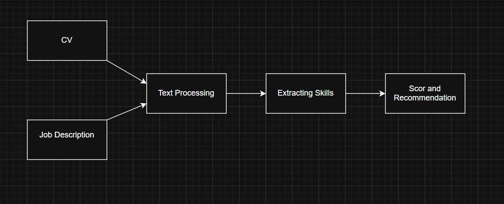

# CV Parsing and HR Assistant

##  Echipa
- Matei Amalia Andreea
- Moga Victor Gabriel
- Marin Lorena Anamaria

---

##  Problema abordată

În procesele de recrutare, departamentele de HR trebuie să analizeze un număr mare de CV-uri pentru fiecare poziție deschisă. Acest proces este lent, ineficient și predispus la erori și bias.

Scopul proiectului este dezvoltarea unui sistem inteligent bazat pe AI care poate analiza automat CV-uri și descrieri de joburi pentru a ajuta la selecția candidaților potriviți.

---

##  Input

- CV-uri (format PDF sau text)
- Job Description (text)

---

##  Output

- Scor de potrivire (%)
- Lista de competențe identificate
- Recomandări pentru HR (ex: întrebări de interviu)

---

##  Utilizator țintă

- Recruiteri / HR

---

##  Tipul de AI folosit

- Natural Language Processing (NLP)
- Embeddings (ex: BERT / Sentence-BERT)
- Agent AI cu tool usage

---

##  Analiza datelor de intrare

Datele folosite sunt:
- texte nestructurate (CV-uri)
- descrieri de joburi

Probleme identificate:
- formate diferite (PDF, text)
- informații nestructurate
- dificultate în extragerea skill-urilor

Ce extragem:
- competențe (skills)
- experiență
- educație

---

##  Schema soluției

CV + Job Description → Procesare text → Extrage skill-uri → Comparare → Scor + Recomandări

---

##  SDG-uri relevante

- SDG 8 – Decent Work and Economic Growth  
→ ajută la recrutare mai eficientă  

- SDG 10 – Reduced Inequalities  
→ reduce biasul în selecție